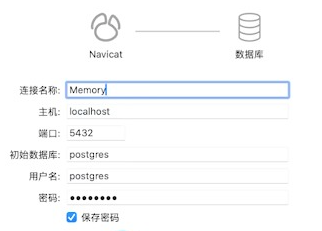

# 1、项目介绍                  
## 1.1 主要内容      
### 1.1.1 本期视频主要内容                          
- 使用FastAPI框架实现对外提供Agent智能体API后端接口服务                                   
- 使用LangGraph中预置的ReAct架构的Agent                                                 
- 支持Short-term(短期记忆)并使用PostgreSQL进行持久化存储                                                           
- 支持Function Calling，包含自定义工具和MCP Server提供的工具                                           
- 支持Human in the loop(HIL 人工审查)对工具调用提供人工审查功能，支持四种审查类型                                                                              
- 支持多厂家大模型接口调用，OpenAI、阿里通义千问、本地开源大模型(Ollama)等                                     
- 支持Redis存储用户会话状态,支持客户端的故障恢复和服务端的故障恢复                                      
- 使用功能强大的rich库实现前端demo应用,与后端API接口服务联调                     
   
本期视频是在ReActAgentsTest项目基础进行更新，所使用的代码文件夹为:**04_ReActAgentHILApiTest**,源码及相关资料均开源免费共享给大家，大家进入项目中进行下载:            
https://github.com/NanGePlus/ReActAgentsTest                                                                                      
https://gitee.com/NanGePlus/ReActAgentsTest                         
关于如何构建ReActAgentsTest项目，大家参考本期系列视频的第一期视频有详细的实操演示,链接地址如下:                                                                                   
https://youtu.be/rYpCU1cDvvc                                           
https://www.bilibili.com/video/BV1V7EfzDERy/                    

### 1.1.2 后端业务核心流程                             
查看docs/01_后端业务核心流程.pdf和02_API接口和数据模型描述.pdf                                             

### 1.1.3 前端业务核心流程                                  
查看docs/03_前端业务核心流程.pdf                                 

## 1.2 LangGraph介绍 
LangGraph 是由 LangChain 团队开发的一个开源框架，旨在帮助开发者构建基于大型语言模型（LLM）的复杂、有状态、多主体的应用                
官方文档:https://langchain-ai.github.io/langgraph/                    
关于LangGraph大家可以参考如下项目，里面有详细的源码资料和视频分享:                      
https://github.com/NanGePlus/LangGraphChatBot                      
https://github.com/NanGePlus/ReActAgentsTest                 

## 1.3 MCP协议介绍
MCP官方简介:https://www.anthropic.com/news/model-context-protocol                                                                                           
MCP文档手册:https://modelcontextprotocol.io/introduction                                                        
MCP官方服务器列表:https://github.com/modelcontextprotocol/servers                                  
PythonSDK的github地址:https://github.com/modelcontextprotocol/python-sdk                     
南哥AGI研习社MCP项目分享地址:https://github.com/NanGePlus/MCPServerTest                          
建议大家可以通过下面这期视频了解下MCP相关内容，有关于HTTP+SSE传输模式的介绍                                     
【大模型应用开发-MCP系列】03 为什么会出现MCP？MCP新标准(03.26版)3种传输模式,STDIO、HTTP+SSE、Streamable HTTP                           
https://youtu.be/EId3Kbmb_Ao                    
https://www.bilibili.com/video/BV1ZHEgzXEP1/                             

# 2、前期准备工作
## 2.1 集成开发环境搭建  
anaconda提供python虚拟环境,pycharm提供集成开发环境                                              
**具体参考如下视频:**                        
【大模型应用开发-入门系列】03 集成开发环境搭建-开发前准备工作                         
https://youtu.be/KyfGduq5d7w                     

## 2.2 大模型LLM服务接口调用方案
(1)gpt大模型等国外大模型使用方案                  
国内无法直接访问，可以使用代理的方式，具体代理方案自己选择                        
这里推荐大家使用:https://nangeai.top/register?aff=Vxlp                        
(2)非gpt大模型方案 OneAPI方式或大模型厂商原生接口                                              
(3)本地开源大模型方案(Ollama方式)                                              
**具体参考如下视频:**                                           
【大模型应用开发-入门系列】04 大模型LLM服务接口调用方案                    
https://youtu.be/mTrgVllUl7Y                           

# 3、项目初始化
## 3.1 下载源码
GitHub或Gitee中下载工程文件到本地，下载地址如下：                   
https://github.com/NanGePlus/ReActAgentsTest                                                                                   
https://gitee.com/NanGePlus/ReActAgentsTest                                                                                      

## 3.2 构建项目 
使用pycharm构建一个项目，为项目配置虚拟python环境                                   
项目名称：ReActAgentsTest                                                                
虚拟环境名称保持与项目名称一致                                                  
 
## 3.3 将相关代码拷贝到项目工程中           
将下载的代码文件夹中的文件全部拷贝到新建的项目根目录下                           

## 3.4 安装项目依赖                                  
新建命令行终端，在终端中运行如下指令进行安装                        
pip install langgraph==0.4.5                                     
pip install langchain==0.3.25                                         
pip install langchain-openai==0.3.17                                        
pip install langgraph-checkpoint-postgres==2.0.21                        
pip install rich==14.0.0                                 
pip install fastapi==0.115.12                            
pip install redis==6.2.0                        
pip install concurrent-log-handler==0.9.28                   
**注意:** 建议先使用要求的对应版本进行本项目测试，避免因版本升级造成的代码不兼容。测试通过后，可进行升级测试                               

# 4、功能测试
## 4.1 使用Docker方式运行PostgreSQL数据库和Redis数据库                                      
进入官网 https://www.docker.com/ 下载安装Docker Desktop软件并安装，安装完成后打开软件                                
打开命令行终端，cd 04_ReActAgentHILApiTest文件夹下                     
进入到docker/postgresql下执行 docker-compose up -d 运行PostgreSQL服务                                         
进入到docker/redis下执行 docker-compose up -d 运行Redis服务                                            
运行成功后可在Docker Desktop软件中进行管理操作或使用命令行操作或使用指令                     
使用数据库客户端软件远程登陆进行可视化操作，这里使用Navicat客户端软件和Redis-Insight客户端软件

## 4.2 功能测试          
进入04_ReActAgentHILApiTest文件夹下运行脚本进行测试，支持多用户访问                    
首先运行后端服务 python 01_backendServer.py                        
再运行前端服务 python 02_frontendServer.py           

### 4.2.1 测试HIL 对工具请求进行人类反馈
使用python实现的一个模拟酒店预订的工具book_hotel                                       
其需传入的参数为:{hotel_name}                
使用python实现的一个计算两个数的乘积的工具multiply                      
其需传入的参数为:{a:float, b:float}       
**测试流程:**                     
(1)输入 'yes' 接受工具调用           
调用工具预定如家酒店           
(2)输入 'no' 拒绝工具调用                       
调用工具预定桔子酒店           
(3)输入 'edit' 修改工具参数后调用工具                  
调用工具预定全季酒店                          
{"hotel_name": "全季酒店(软件园店)"}                               
(4)输入 'response' 不调用工具直接反馈信息                          
调用工具预定汉庭酒店                                     
把酒店名称换为：汉庭酒店(软件园店)，再调用工具预定              

### 4.2.2 测试客户端和服务端故障恢复
(1)这个118.79815,32.01112经纬度对应的地方是哪里               
(2)夫子庙的经纬度坐标是多少                  
(3)112.10.22.229这个IP所在位置               
(4)上海的天气如何                 
(5)我要从上海豫园骑行到上海人民广场，帮我规划下路径                
(6)我要从上海豫园步行到上海人民广场，帮我规划下路径               
(7)我要从上海豫园驾车到上海人民广场，帮我规划下路径               
(8)我要从上海豫园坐公共交通到上海人民广场，帮我规划下路径              
(9)测量下从上海豫园到上海人民广场驾车距离是多少                
(10)在上海豫园附近的中石化的加油站有哪些，需要有POI的ID                 
(11)POI为B00155LA8A的详细信息             
(12)在上海豫园周围10公里的中石化的加油站                 
**高德地图 MCP Server介绍:**               
为实现 LBS 服务与 LLM 更好的交互，高德地图 MCP Server 现已覆盖12大核心服务接口，提供全场景覆盖的地图服务                   
包括地理编码、逆地理编码、IP 定位、天气查询、骑行路径规划、步行路径规划、驾车路径规划、公交路径规划、距离测量、关键词搜索、周边搜索、详情搜索等                 
链接地址:https://lbs.amap.com/api/mcp-server/summary              
具体提供的接口详情介绍:                  
**(1)地理编码**                
name='maps_regeocode'               
description='将一个高德经纬度坐标转换为行政区划地址信息'                       
inputSchema={'type': 'object', 'properties': {'location': {'type': 'string', 'description': '经纬度'}}, 'required': ['location']}                   
**(2)逆地理编码**               
name='maps_geo'              
description='将详细的结构化地址转换为经纬度坐标。支持对地标性名胜景区、建筑物名称解析为经纬度坐标'               
inputSchema={'type': 'object', 'properties': {'address': {'type': 'string', 'description': '待解析的结构化地址信息'}, 'city': {'type': 'string', 'description': '指定查询的城市'}}, 'required': ['address']}                  
**(3)IP 定位**               
name='maps_ip_location'         
description='IP 定位根据用户输入的 IP 地址，定位 IP 的所在位置'            
inputSchema={'type': 'object', 'properties': {'ip': {'type': 'string', 'description': 'IP地址'}}, 'required': ['ip']}                
**(4)天气查询**               
name='maps_weather'               
description='根据城市名称或者标准adcode查询指定城市的天气'                 
inputSchema={'type': 'object', 'properties': {'city': {'type': 'string', 'description': '城市名称或者adcode'}}, 'required': ['city']}             
**(5)骑行路径规划**               
name='maps_bicycling'     
description='骑行路径规划用于规划骑行通勤方案，规划时会考虑天桥、单行线、封路等情况。最大支持 500km 的骑行路线规划'     
inputSchema={'type': 'object', 'properties': {'origin': {'type': 'string', 'description': '出发点经纬度，坐标格式为：经度，纬度'}, 'destination': {'type': 'string', 'description': '目的地经纬度，坐标格式为：经度，纬度'}}, 'required': ['origin', 'destination']}      
**(6)步行路径规划**               
name='maps_direction_walking'      
description='步行路径规划 API 可以根据输入起点终点经纬度坐标规划100km 以内的步行通勤方案，并且返回通勤方案的数据'       
inputSchema={'type': 'object', 'properties': {'origin': {'type': 'string', 'description': '出发点经度，纬度，坐标格式为：经度，纬度'}, 'destination': {'type': 'string', 'description': '目的地经度，纬度，坐标格式为：经度，纬度'}}, 'required': ['origin', 'destination']}        
**(7)驾车路径规划**                
name='maps_direction_driving'          
description='驾车路径规划 API 可以根据用户起终点经纬度坐标规划以小客车、轿车通勤出行的方案，并且返回通勤方案的数据。'            
inputSchema={'type': 'object', 'properties': {'origin': {'type': 'string', 'description': '出发点经度，纬度，坐标格式为：经度，纬度'}, 'destination': {'type': 'string', 'description': '目的地经度，纬度，坐标格式为：经度，纬度'}}, 'required': ['origin', 'destination']}            
**(8)公交路径规划**              
name='maps_direction_transit_integrated'           
description='公交路径规划 API 可以根据用户起终点经纬度坐标规划综合各类公共（火车、公交、地铁）交通方式的通勤方案，并且返回通勤方案的数据，跨城场景下必须传起点城市与终点城市'           
inputSchema={'type': 'object', 'properties': {'origin': {'type': 'string', 'description': '出发点经度，纬度，坐标格式为：经度，纬度'}, 'destination': {'type': 'string', 'description': '目的地经度，纬度，坐标格式为：经度，纬度'}, 'city': {'type': 'string', 'description': '公共交通规划起点城市'}, 'cityd': {'type': 'string', 'description': '公共交通规划终点城市'}}, 'required': ['origin', 'destination', 'city', 'cityd']}         
**(9)距离测量**              
name='maps_distance'            
description='距离测量 API 可以测量两个经纬度坐标之间的距离,支持驾车、步行以及球面距离测量'      
inputSchema={'type': 'object', 'properties': {'origins': {'type': 'string', 'description': '起点经度，纬度，可以传多个坐标，使用分号隔离，比如120,30;120,31，坐标格式为：经度，纬度'}, 'destination': {'type': 'string', 'description': '终点经度，纬度，坐标格式为：经度，纬度'}, 'type': {'type': 'string', 'description': '距离测量类型,1代表驾车距离测量，0代表直线距离测量，3步行距离测量'}}, 'required': ['origins', 'destination']}        
**(10)关键词搜索**         
name='maps_text_search'           
description='关键词搜，根据用户传入关键词，搜索出相关的POI'           
inputSchema={'type': 'object', 'properties': {'keywords': {'type': 'string', 'description': '搜索关键词'}, 'city': {'type': 'string', 'description': '查询城市'}, 'types': {'type': 'string', 'description': 'POI类型，比如加油站'}}, 'required': ['keywords']}              
**(11)周边搜索**            
name='maps_search_detail'            
description='查询关键词搜或者周边搜获取到的POI ID的详细信息'              
inputSchema={'type': 'object', 'properties': {'id': {'type': 'string', 'description': '关键词搜或者周边搜获取到的POI ID'}}, 'required': ['id']}              
**(12)详情搜索**                 
name='maps_around_search'            
description='周边搜，根据用户传入关键词以及坐标location，搜索出radius半径范围的POI'              
inputSchema={'type': 'object', 'properties': {'keywords': {'type': 'string', 'description': '搜索关键词'}, 'location': {'type': 'string', 'description': '中心点经度纬度'}, 'radius': {'type': 'string', 'description': '搜索半径'}}, 'required': ['location']})]               

